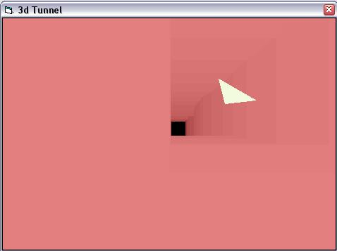



## ThreeD Tunnel Spoof

### Description

Just a little Game. You are a ship and you fly through a tunnel. Objective to get as far as you can without touching the walls. The Walls do close in over time.
 
### More Info
 
It does not use directX so you can learn some 3D math... =) and I am not familiar with it =P. Enjoy my code ^_^ V

             |
---                |---
**Submitted On**   |2003-08-25 16:04:02
**By**             |[Boa Kwan](https://github.com/Planet-Source-Code/PSCIndex/blob/master/ByAuthor/boa-kwan.md)
**Level**          |Intermediate
**User Rating**    |5.0 (15 globes from 3 users)
**Compatibility**  |VB 5\.0, VB 6\.0
**Category**       |[Games](https://github.com/Planet-Source-Code/PSCIndex/blob/master/ByCategory/games__1-38.md)
**World**          |[Visual Basic](https://github.com/Planet-Source-Code/PSCIndex/blob/master/ByWorld/visual-basic.md)
**Archive File**   |[ThreeD\_Tun1635238252003\.zip](https://github.com/Planet-Source-Code/boa-kwan-threed-tunnel-spoof__1-47980/archive/master.zip)

